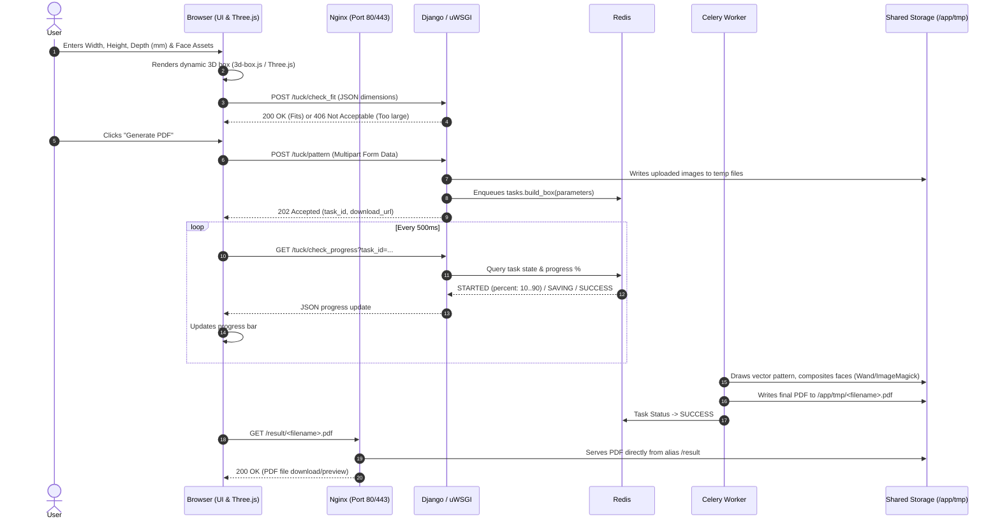
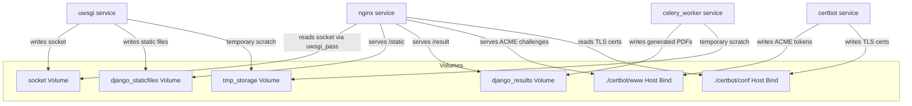

# AGENTS.md — Developer & AI Agent Guide to `bg_upgrades`

## 1. Project Overview

**`bg_upgrades`** is a specialized web application designed for board game hobbyists to custom-design, 3D-preview, and generate printable **tuckbox patterns as high-resolution PDF files** (typically for custom card decks and game components).

### Key Highlights
- **Interactive 3D Preview**: Renders the custom box live in WebGL (Three.js) as the user adjusts dimensions, uploads artwork, or toggles flaps.
- **Parametric Pattern Layout**: Automatically computes box geometry, fold lines, finger-hold notches, glue tabs, and cut lines at 600 DPI based on mm inputs.
- **Asynchronous PDF Generation**: Offloads heavy graphical composition (ImageMagick/Wand) to Celery workers with a real-time progress bar.
- **Production-Ready Docker Architecture**: Multi-container stack utilizing Nginx, uWSGI via UNIX domain socket, Celery, Redis, and automated Let's Encrypt SSL.

---

## 2. Technology Stack & Dependencies

| Component | Technology | Role |
| :--- | :--- | :--- |
| **Web Framework** | Django 6.x (Python 3.12) | Web routing, form validation, views, task orchestration |
| **Async Task Queue** | Celery 5.6.x + Redis 8.x | Background image transformation and PDF rendering |
| **Graphics & Drawing** | ImageMagick + Wand 0.7.x | 600 DPI vector drawing, bezier curves, image composition |
| **PDF Manipulation** | PyPDF 6.x | Merging multi-page PDF pattern documents |
| **Web Server / Proxy** | Nginx 1.27.x (Alpine) | SSL termination, reverse proxying, static and PDF file serving |
| **App Server** | uWSGI 2.0.x | High-performance WSGI server communicating via UNIX socket |
| **Frontend UI** | Jinja2/Django templates, Bootstrap 4, jQuery | Responsive user input form and progress tracking |
| **3D Rendering** | Three.js + OrbitControls | Real-time 3D box model with dynamic texture and color mapping |
| **Color Utilities** | vanilla-picker, Name That Color (`ntc.js`) | Face color selection |
| **SSL / TLS** | Certbot / Let's Encrypt | Automated HTTPS certificate generation and renewal |

---

## 3. Architecture & Repository Structure

```
bg_upgrades/
├── AGENTS.md                   # This documentation
├── Dockerfile                  # Base Python 3.12 Alpine image with ImageMagick & uWSGI
├── docker-compose.yml          # Multi-container orchestration (Redis, Celery, uWSGI, Nginx, Certbot)
├── docker_env                  # Environment variables for local development
├── docker_env.prod             # Environment variables for production
├── requirements.txt            # Python dependencies
├── uwsgi/
│   ├── uwsgi.ini               # uWSGI configuration (socket, processes, master)
│   └── start_uwsgi.sh          # Container entrypoint (migrate, collectstatic, chown, launch uwsgi)
├── nginx/
│   ├── Dockerfile.prod         # Production Nginx image (loads bg-upgrades.net-nginx.conf)
│   ├── Dockerfile.test.nossl   # Local testing without SSL
│   ├── Dockerfile.text.ssl     # Local testing with self-signed SSL
│   ├── bg-upgrades.net-nginx.conf # Production Nginx config (HTTPS, Let's Encrypt, uwsgi_pass)
│   ├── mysite.test-nginx.conf  # Local SSL testing config
│   ├── nossl.nginx.conf        # Local HTTP-only config
│   ├── options-ssl-nginx.conf  # Recommended SSL ciphers/protocols
│   └── uwsgi_params            # Standard uwsgi proxy params
├── certbot/
│   ├── conf/                   # Mount for Let's Encrypt certificates
│   └── www/                    # Mount for ACME webroot challenges (/.well-known/acme-challenge/)
└── django_app/
    ├── manage.py               # Django management CLI
    ├── db.sqlite3              # SQLite database
    ├── tmp/                    # Generated PDFs directory (shared volume /result)
    ├── templates/
    │   └── about.html          # About page template
    ├── bg_upgrades/            # Django project root configuration
    │   ├── settings.py         # Settings, Celery broker, TMP_ROOT, static configurations
    │   ├── urls.py             # Root URL router (/ -> /tuck/, /about, /admin)
    │   ├── wsgi.py             # WSGI entrypoint
    │   └── celery.py           # Celery application initialization
    └── tuckbox/                # Core application
        ├── box.py              # Math, vector geometry, Wand drawing, ImageMagick resizing, PDF generation
        ├── tasks.py            # Celery task definition (build_box) and status polling
        ├── views.py            # HTTP handlers (index, pattern, preview, check_fit, check_progress)
        ├── urls.py             # Application URL routes
        ├── models.py           # Django models (stateless application; currently empty)
        ├── Colombia-Regular.ttf# Font for PDF watermark
        ├── static/tuckbox/
        │   ├── 3d-box.js       # Three.js 3D box model renderer and texture/color manager
        │   ├── style.css       # Custom styles
        │   └── js/             # Local Three.js and ESM addons
        ├── templates/
        │   └── pattern_form.html.j2 # Main user interface template
        └── test/               # Unit, visual regression, and Selenium tests
            ├── tests_box.py    # Wand visual comparison tests against reference PNGs
            └── tests_form.py   # Django View tests & Selenium browser automation tests
```

---

## 4. How the Application Works



### Detailed Breakdown

### 4.1 Frontend & Live 3D Preview (`pattern_form.html.j2`, `3d-box.js`)
1. **Inputs**:
   - **Tuckbox Dimensions**: Width, Height, Depth in millimeters.
   - **Paper Size**: Presets (A4, A3, Letter, Legal) or Custom dimensions (width/height in mm).
   - **Box Options**:
     - `folding_guides`: Adds edge corner guides for cutting and folding.
     - `folds_dashed`: Renders internal fold lines as dashed gray lines.
     - `two_openings`: Adds top and bottom opening flaps instead of a glued solid bottom.
     - `two_pages`: Splits larger boxes across two printable sheets when the pattern exceeds a single page.
   - **6 Faces** (`front`, `back`, `left`, `right`, `top`, `bottom`):
     - Plain color picker (vanilla-picker + hex color) OR image upload (`.png`, `.jpg`, etc.).
     - Rotation angle selector (0°, 90°, 180°, 270°).
2. **Three.js 3D Preview (`3d-box.js`)**:
   - Constructs a 6-sided 3D box mesh scaled proportionally inside `#image_preview`.
   - Uses `OrbitControls` for user panning, zooming, and rotating.
   - Updates textures/colors in real-time as the user uploads images or selects colors.
   - Animates bottom flap opening/closing when "Two Openings" is toggled.
3. **Client-side Validation & Fit Check (`/tuck/check_fit`)**:
   - On dimension changes, sends an AJAX request to `/tuck/check_fit`.
   - Calls backend `box.TuckBoxDrawing.will_it_fit()`. If the computed pattern size exceeds paper bounds, the UI highlights "#id_wont_fit" and disables the submit button.

### 4.2 Form Submission & Task Dispatch (`views.py`)
- Form submissions are intercepted via AJAX (`FormData`).
- Files and angles are extracted; images are written to temporary files.
- Generates a unique target filename in `settings.TMP_ROOT` (`/app/tmp/<name>.pdf`).
- Dispatches async task: `tasks.build_box.delay(parameters)`.
- Responds with HTTP `202 Accepted` containing the `task_id` and the static result URL (`/result/<filename>.pdf`).

### 4.3 Pattern Drawing & PDF Generation Engine (`box.py`, `tasks.py`)
- **Resolution & Unit Scaling**:
  - `RESOLUTION = 600 DPI`
  - `POINT_PER_MM = 600 / 25.4 ≈ 23.62 points per mm`
  - Memory ceiling for Wand is capped at 100MB before spilling to disk (`limits['memory'] = 100 * 1024 * 1024`).
- **Geometry Generation**:
  - **Outer Cut Lines**: Solid black polyline borders and bezier curves for rounded tuck flaps (`Drawing.polyline`, `Drawing.bezier`).
  - **Fold Lines**: Dashed gray lines with computed dash arrays.
  - **Thumb Grips / Finger Holds**: Arc cutouts on top/bottom flaps for easy card removal.
  - **Lip Masks & Color Attenuation**: Uses ImageMagick `fx` expressions to smoothly fade artwork into the thumb grip cutouts.
  - **Face Artwork Compositing**: Calls ImageMagick CLI (`magick <src> -rotate <deg> -resize <WxH>! <dst>`) to scale and orient user images, then composites them onto the canvas.
  - **Multi-page Support**: If `two_pages` is enabled, draws the front assembly and back assembly on separate image canvases and stitches them into a single multi-page PDF using `pypdf.PdfWriter`.
  - **Watermark**: Inscribes `Tuckbox generated @ https://www.bg-upgrades.net/` using `Colombia-Regular.ttf`.
- **Progress Tracking**:
  - Emits percentage updates (5% -> 10% -> 20..80% during face drawing -> 90% -> 100%) to Celery task metadata (`STARTED` / `SAVING`).
  - Automatically unlinks uploaded source images upon completion.

### 4.4 Result Serving
- Frontend polls `/tuck/check_progress?task_id=...` until `state == "SUCCESS"`.
- Nginx directly serves `/result/<filename>.pdf` from the shared `django_results` volume.

---

## 5. Production Server Deployment with Docker

Production deployment uses a 5-service architecture in [`docker-compose.yml`](file:///home/djens/projects/bg_upgrades/docker-compose.yml).

### 5.1 Docker Services Breakdown

| Service | Image / Build Context | Key Responsibilities & Config |
| :--- | :--- | :--- |
| **`nginx`** | Built from [`nginx/Dockerfile.prod`](file:///home/djens/projects/bg_upgrades/nginx/Dockerfile.prod) | • Listens on 80 and 443<br>• Enforces HTTPS redirect<br>• Serves `/static/` from `django_staticfiles` volume<br>• Serves `/result/` from `django_results` volume<br>• Routes `location /` via `uwsgi_pass unix:///sock/mysite.sock`<br>• Handles ACME challenge path for Certbot (`/.well-known/acme-challenge/`) |
| **`uwsgi`** | Built from [`Dockerfile`](file:///home/djens/projects/bg_upgrades/Dockerfile) | • Entrypoint: [`uwsgi/start_uwsgi.sh`](file:///home/djens/projects/bg_upgrades/uwsgi/start_uwsgi.sh)<br>• Runs migrations (`manage.py migrate`)<br>• Collects static files (`manage.py collectstatic --noinput`)<br>• Cleans old `/app/tmp` scratch files<br>• Runs uWSGI master + 10 worker processes as user `app`<br>• Listens on UNIX socket `/sock/mysite.sock` |
| **`celery_worker`** | Built from [`Dockerfile`](file:///home/djens/projects/bg_upgrades/Dockerfile) | • Command: `celery -A bg_upgrades worker -l info`<br>• Executes `tasks.build_box`<br>• Writes generated PDFs to `/app/tmp` (`django_results` volume) |
| **`redis`** | `redis:8.0-alpine` | • In-memory message broker & Celery results backend |
| **`certbot`** | `certbot/certbot:latest` | • Manages SSL certificate requests & renewals |

### 5.2 Volume & IPC Matrix



### 5.3 Production Environment Variables (`docker_env.prod`)

```env
DEBUG=0
DJANGO_DEBUG=False
SECRET_KEY=<generate_secure_random_secret_key>
DJANGO_PROJECT_PATH=/app
```

> [!IMPORTANT]
> Always replace the placeholder `SECRET_KEY` in production. You can generate a new key with:
> ```bash
> python -c 'from django.core.management.utils import get_random_secret_key; print(get_random_secret_key())'
> ```

### 5.4 How to Launch in Production

1. **Configure Production Settings in `docker-compose.yml`**:
   - Ensure `uwsgi` and `celery_worker` point to `env_file: - ./docker_env.prod`.
   - Ensure `nginx` uses `dockerfile: ./Dockerfile.prod`.
2. **Build and Start Containers**:
   ```bash
   docker compose up -d --build
   ```
3. **Verify Service Status**:
   ```bash
   docker compose ps
   docker compose logs -f uwsgi nginx celery_worker
   ```

### 5.5 SSL / Let's Encrypt Certificate Renewal
Certificates are stored in `./certbot/conf/live/www.bg-upgrades.net/` and shared with Nginx.

A cron job on the host system checks for renewals every 3 days (e.g. in `/etc/cron.d/certbot`):
```cron
0 3 */3 * * cd /home/ubuntu/bg_upgrades && perl -e 'sleep int(rand(43200))' && docker compose run --rm certbot renew && docker compose exec nginx nginx -s reload
```

---

## 6. Local Development & Testing

### 6.1 Running Locally with Docker (No SSL)
1. In `docker-compose.yml`:
   - `nginx` uses `dockerfile: ./Dockerfile.test.nossl`.
   - `env_file` points to `./docker_env`.
2. Run:
   ```bash
   docker compose up -d --build
   ```
3. Access at `http://localhost/` or `http://127.0.0.1/`.

### 6.2 Running Locally with Docker (Local SSL / `mysite.test`)
1. Generate local certs using [`nginx/ssl/create_local_cert.sh`](file:///home/djens/projects/bg_upgrades/nginx/ssl/create_local_cert.sh) (refer to [`nginx/ssl/ssl.md`](file:///home/djens/projects/bg_upgrades/nginx/ssl/ssl.md)).
2. In `docker-compose.yml`:
   - Set `nginx` `dockerfile: ./Dockerfile.text.ssl`.
3. Add `127.0.0.1 mysite.test` to `/etc/hosts` (or `C:\Windows\System32\drivers\etc\hosts`).
4. Access at `https://mysite.test/`.

### 6.3 Running Standalone (Without Docker)
1. **Prerequisites**: Python 3.10+, ImageMagick 7+ with PDF delegate, Redis server, ChromeDriver (for Selenium).
2. **Setup virtualenv**:
   ```bash
   virtualenv venv
   source venv/bin/activate
   pip install -r requirements.txt
   ```
3. **Start Redis & Celery Worker**:
   ```bash
   redis-server &
   celery -A bg_upgrades -b redis://127.0.0.1:6379 worker -l info &
   ```
4. **Run Django Dev Server**:
   ```bash
   cd django_app
   python manage.py migrate
   python manage.py runserver 0.0.0.0:8000
   ```
   Or via uWSGI HTTP mode:
   ```bash
   uwsgi --http :8000 --module bg_upgrades.wsgi --chdir django_app/
   ```

### 6.4 Running the Test Suite
From the `django_app/` directory:

- **Run all tests**:
  ```bash
  python manage.py test --parallel
  ```
- **Visual Regression Tests ([`tests_box.py`](file:///home/djens/projects/bg_upgrades/django_app/tuckbox/test/tests_box.py))**:
  Compares rendered output against reference PNGs in `django_app/tuckbox/test/` using Wand `image.compare(ref_image, metric='mean_absolute')`.
  To regenerate/update reference images:
  ```bash
  python -m tuckbox.test.tests_box
  ```
- **Browser Automation Tests ([`tests_form.py`](file:///home/djens/projects/bg_upgrades/django_app/tuckbox/test/tests_form.py))**:
  Uses Selenium WebDriver to validate dynamic DOM behavior, input masking, 3D container initialization, and fit recalculation.

---

## 7. Important Notes & Tips for Agents

- **ImageMagick PDF Policy**: If PDF conversion fails with `security policy 'PDF' blocking conversion`, ensure `/etc/ImageMagick-7/policy.xml` (or `/etc/ImageMagick-6/policy.xml`) allows `read|write` rights for `pattern="PDF"`.
- **Directory Permissions**: The Docker container creates an unprivileged user `app:app`. `start_uwsgi.sh` explicitly performs `chown -R app:app /sock /app/tmp` to guarantee socket and temporary file write permissions.
- **Stateless Database**: The app uses an SQLite database (`db.sqlite3`) primarily for Django session and admin scaffolding. Tuckbox generation is stateless and file-based.
- **Dual Nginx / Dev File Serving**: In development (`DEBUG=True`), `urls.py` appends `static(settings.TMP_URL, document_root=settings.TMP_ROOT)`. In production, Nginx serves `/result` and `/static` directly for performance.
